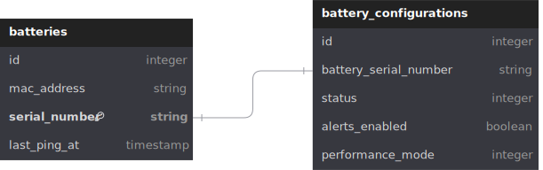

# Moon Battery

## **Table of Contents**

1. [Overview](#overview)
2. [How to Run the Project Locally](#how-to-run-the-project-locally)
3. [Implementation Discussion](#implementation-discussion)

## Overview
The moonBattery is a new storage system that allows to storage of the energy produced by lunar cells. Each moonBattery is registered with the moonBattery IoT backend. In this code challenge, we will develop the API of the backend with 3 endpoints utilizing Ruby on Rails and Mysql.


## How to run the project locally

### Used Ports

This application uses the following ports:

- **3000**: Rails server.
- **3306**: MySQL database.

_Make sure these ports are available and not in use by other services on your machine._

### Setup
1. **Clone the repo**

   Start by cloning the repository to your local machine:

   ```bash
   git clone https://github.com/badrannn/sonnen-moonBattery.git
   cd MoonBattery
   
3. **Run the project with Docker**

   To start the application using Docker, execute the following command:

   ```bash
   docker-compose up --build

### Running the unit tests
1. Attach a shell to the rails app container
2. Run the tests
   ```bash
   bundle exec rspec
   
### API endpoints
_your project should be running over localhost:3000_

#### Batteries
- **Create Battery (Register)**  (only permissible to modify the name through a JSON body)
  
  `POST /batteries`

  **Example Request Body:**
  
   ```json
   {
    "battery":{
        "mac_address": "11:23:45:67:89:AB"
    }
  }

**Example Response:**
  ```json
  {
    "message": "Battery created successfully. Your device serial number is: ee1a9611-7922-42aa-b4b3-1d6c2f7ff341"
  }
```
  

- **Update last_pinged_at (PING)**  
  `PATCH /batteries/SERIAL_NUMBER/ping`

   **Example Response:**
  
   ```json
   {
    "message": "Ping received at: 2024-10-29 15:19:52 +0000"
   }
   ```


#### Battery Configurations

- **Update Configurations**  
  `PATCH /batteries/BATTERY_SERIAL_NUMBER/configurations`

  **Example Request Body:**
  
   ```json
   {
    "battery_configurations": {
        "status": 2
    }
   }
   ```


## Implementation Discussion

#### Database Design
The database design is illustrated in the following graphic:



### Created Indexes

- **Batteries Table**:
  - `index_batteries_on_mac_address`: This index speeds up queries that search for batteries using the mac_address.
  - `index_batteries_on_serial_number`: This index speeds up queries that search for batteries using the serial_number field.

- **battery_configurations Table**:
  - `index_battery_configurations_on_battery_serial_number`: A unique index that ensures data integrity and speeds up queries.


### Authentication

#### 1. Use TLS
- **Description**: Ensure all communication is conducted over HTTPS to encrypt data in transit avoiding man-in-the-middle attacks.
- **Implementation**: Obtain a TLS certificate and configure the backend to accept only HTTPS connections.

#### 2. API Token Authentication
- **Description**: Use token-based authentication.
- **Implementation**:
  - Generate a unique API token for each device upon registration.
  - Require the token in the headers of each request (e.g., `Authorization: Bearer <token>`).
